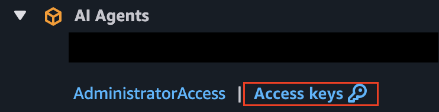
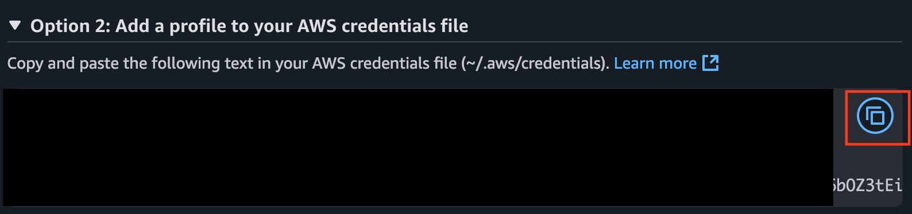

<h1 align="center">
    🚀 Site Reliability Engineer (SRE) Agent :detective:
</h1>

Welcome to the **SRE Agent** project! This AI agent assists with debugging, keeps your systems healthy, and makes your DevOps life easier. Plug in your Kubernetes cluster, GitHub repo, and Slack, and let the agent do the heavy lifting—diagnosing, reporting, and keeping your team in the loop.

## 🌟 What is SRE Agent?

SRE Agent is your AI-powered teammate for monitoring application and infrastructure logs, diagnosing issues, and reporting diagnostics after errors. It connects directly into your stack, so you can focus on building, not firefighting.

## 🤔 Why This Project?

This project explores best practices, costs, security, and performance considerations for AI agents in production. Check out the [Production Journey Page](/docs/production-journey.md) and [Agent Architecture Page](/docs/agent-architecture.md) for more details.

## ✨ Features

- 🕵️‍♂️ **Root Cause Debugging** – Finds the real reason behind app and system errors
- 📜 **Kubernetes Logs** – Queries your cluster for logs and info
- 🔍 **GitHub Search** – Digs through your codebase for bugs
- 💬 **Slack Integration** – Notifies and updates your team
- 🚦 **Diagnose from Anywhere** – Trigger diagnostics with a simple endpoint

> Powered by the [Model Context Protocol (MCP)](https://github.com/modelcontextprotocol) for seamless LLM-to-tool connectivity.

## 🤖 Supported LLM Providers

The SRE Agent supports multiple the following LLM providers:

### Anthropic
- **Models**: e.g. "claude-4-0-sonnet-latest"
- **Setup**: Requires `ANTHROPIC_API_KEY`

### Google Gemini
- **Models**: e.g, "gemini-2.5-flash"
- **Setup**: Requires `GEMINI_API_KEY`


## 🛠️ Prerequisites

- [Docker](https://docs.docker.com/get-docker/)
- A `.env` file in your project root ([see below](#getting-started))
- **Option A**: An app deployed on AWS EKS or GCP GKE (Kubernetes)
- **Option B**: Any app that can write logs to a file (No Kubernetes required!)

## ⚡ Quick Start (5 minutes)

### 1️⃣ Set up credentials
```bash
python setup_credentials.py --platform aws  # or --platform gcp
```

### 2️⃣ Configure cloud access
**AWS:** Add credentials to `~/.aws/credentials` | **GCP:** Run `gcloud auth login`

### 3️⃣ Deploy with pre-built images (fastest!)
```bash
# AWS ECR (recommended)
aws ecr get-login-password --region [YOUR_REGION] | docker login --username AWS --password-stdin $(aws sts get-caller-identity --query Account --output text).dkr.ecr.[YOUR_REGION].amazonaws.com
docker compose -f compose.ecr.yaml up -d

# OR GCP GAR
gcloud auth configure-docker [YOUR_REGION]-docker.pkg.dev
docker compose -f compose.gar.yaml up -d
```

### 4️⃣ Test it works
```bash
curl -X POST http://localhost:8003/diagnose \
  -H "Authorization: Bearer $(grep DEV_BEARER_TOKEN .env | cut -d'=' -f2)" \
  -d '{"text": "your-service-name"}'
```

---

## 📋 Detailed Setup Guide

<details>
<summary>🔧 Step-by-step credential configuration</summary>

### Interactive Credential Setup

Use our interactive setup script to configure your credentials:

```bash
python setup_credentials.py
```

The script will:
- ✅ Auto-detect your platform (AWS/GCP) or let you choose
- ✅ Guide you through credential setup with helpful prompts
- ✅ Show current values and let you update them
- ✅ Create your `.env` file automatically

**Quick start with platform selection:**
```bash
python setup_credentials.py --platform aws
# or
python setup_credentials.py --platform gcp
```

### Manual Cloud Credential Setup

#### For AWS EKS:
1. Go to your AWS access portal and grab your access keys:
   
2. Choose Option 2 and copy credentials into `~/.aws/credentials`:
   

   ```bash
   [default]
   aws_access_key_id=ABCDEFG12345
   aws_secret_access_key=abcdefg123456789
   aws_session_token=abcdefg123456789....=
   ```

#### For GCP GKE:
Set up your GCP credentials using the gcloud CLI:
```bash
gcloud auth login
gcloud config set project YOUR_PROJECT_ID
```

</details>

## 🚀 Deployment Options

### **Recommended: Pre-built Registry Images (2-5 minutes)**

Use pre-built container images for the fastest deployment:

**AWS ECR (Fastest):**
```bash
# Authenticate with ECR
aws ecr get-login-password --region [YOUR_REGION] | docker login --username AWS --password-stdin $(aws sts get-caller-identity --query Account --output text).dkr.ecr.[YOUR_REGION].amazonaws.com

# Deploy with pre-built images
docker compose -f compose.ecr.yaml up -d
```

**GCP GAR:**
```bash
# Authenticate with GAR
gcloud auth configure-docker [YOUR_REGION]-docker.pkg.dev

# Deploy with pre-built images
docker compose -f compose.gar.yaml up -d
```

### **Alternative: Local Build (20-30 minutes)**

If you need to build from source or modify the code:

**For AWS:**
```bash
docker compose -f compose.aws.yaml up --build
```

**For GCP:**
```bash
docker compose -f compose.gcp.yaml up --build
```

### **For Developers: Building and Pushing New Images**

If you're developing features or need to create new registry images:

**Build and Push to AWS ECR:**
```bash
# Build and push all services to ECR
./build_push_docker.sh --aws

# Or set environment variables and run manually
export AWS_REGION=your-region
export AWS_ACCOUNT_ID=your-account-id
./build_push_docker.sh --aws
```

**Build and Push to GCP GAR:**
```bash
# Build and push all services to GAR
./build_push_docker.sh --gcp

# Or set environment variables and run manually
export CLOUDSDK_COMPUTE_REGION=your-region
export CLOUDSDK_CORE_PROJECT=your-project-id
./build_push_docker.sh --gcp
```

**What the build script does:**
- Builds all 7 microservices with `--platform linux/amd64` for consistency
- Tags images with `:dev` for development or `:latest` for production
- Pushes to your configured registry (ECR or GAR)
- **Takes 15-20 minutes** but only needs to be done once per code change

**After pushing new images, use them with:**
```bash
# Pull your new images and deploy
docker compose -f compose.ecr.yaml pull
docker compose -f compose.ecr.yaml up -d
```

> **Note:** AWS credentials must be in your `~/.aws/credentials` file.

You'll see logs like this when everything's running:

```bash
orchestrator-1   |    FastAPI   Starting production server 🚀
orchestrator-1   |
orchestrator-1   |              Searching for package file structure from directories with
orchestrator-1   |              __init__.py files
kubernetes-1     | ✅ Kubeconfig updated successfully.
kubernetes-1     | 🚀 Starting Node.js application...
orchestrator-1   |              Importing from /
orchestrator-1   |
orchestrator-1   |     module   📁 app
orchestrator-1   |              ├── 🐍 __init__.py
orchestrator-1   |              └── 🐍 client.py
orchestrator-1   |
orchestrator-1   |       code   Importing the FastAPI app object from the module with the following
orchestrator-1   |              code:
orchestrator-1   |
orchestrator-1   |              from app.client import app
orchestrator-1   |
orchestrator-1   |        app   Using import string: app.client:app
orchestrator-1   |
orchestrator-1   |     server   Server started at http://0.0.0.0:80
orchestrator-1   |     server   Documentation at http://0.0.0.0:80/docs
orchestrator-1   |
orchestrator-1   |              Logs:
orchestrator-1   |
orchestrator-1   |       INFO   Started server process [1]
orchestrator-1   |       INFO   Waiting for application startup.
orchestrator-1   |       INFO   Application startup complete.
orchestrator-1   |       INFO   Uvicorn running on http://0.0.0.0:80 (Press CTRL+C to quit)
kubernetes-1     | 2025-04-24 12:53:00 [info]: Initialising Kubernetes manager {
kubernetes-1     |   "service": "kubernetes-server"
kubernetes-1     | }
kubernetes-1     | 2025-04-24 12:53:00 [info]: Kubernetes manager initialised successfully {
kubernetes-1     |   "service": "kubernetes-server"
kubernetes-1     | }
kubernetes-1     | 2025-04-24 12:53:00 [info]: Starting SSE server {
kubernetes-1     |   "service": "kubernetes-server"
kubernetes-1     | }
kubernetes-1     | 2025-04-24 12:53:00 [info]: mcp-kubernetes-server is listening on port 3001
kubernetes-1     | Use the following url to connect to the server:
kubernetes-1     | http://localhost:3001/sse {
kubernetes-1     |   "service": "kubernetes-server"
kubernetes-1     | }
```

This means all the services — Slack, GitHub, the orchestrator, the prompt and the MCP servers have started successfully and are ready to handle requests.

## 🧑‍💻 Using the Agent

Trigger a diagnosis with a simple curl command:

```bash
curl -X POST http://localhost:8003/diagnose \
  -H "accept: application/json" \
  -H "Authorization: Bearer <token>" \
  -d "text=<service>"
```

- Replace `<token>` with your dev bearer token (from `.env`)
- Replace `<service>` with the name of your target Kubernetes service

The agent will do its thing and report back in your configured Slack channel 🎉

<details>
<summary>🩺 Checking Service Health</summary>

A `/health` endpoint is available on the orchestrator service:

```bash
curl -X GET http://localhost:8003/health
```

- `200 OK` = All systems go!
- `503 Service Unavailable` = Something's up; check the response for details.

</details>

<details>
<summary>🔧 Deployment Troubleshooting</summary>

**Common Issues:**

**ECR Authentication Errors:**
```bash
# Ensure your AWS region matches your .env file
aws configure get region
# Should match AWS_REGION in your .env file

# Re-authenticate with ECR if login fails
aws ecr get-login-password --region eu-west-2 | docker login --username AWS --password-stdin $(aws sts get-caller-identity --query Account --output text).dkr.ecr.eu-west-2.amazonaws.com
```

**Image Pull Errors:**
- Check that `AWS_ACCOUNT_ID` and `AWS_REGION` in your `.env` file match your actual AWS account
- Ensure you have ECR permissions in your AWS IAM role
- For missing images, the build-and-push script can create them: `./build_push_docker.sh --aws`

**Long Build Times:**
- Use pre-built registry images (`compose.ecr.yaml` or `compose.gar.yaml`) instead of local builds
- Registry deployment takes 2-5 minutes vs 20-30 minutes for local builds

</details>

## 🚀 Deployments

Cloud deployment options are available for production use cases.

---

## 🔧 For Developers

<details>
<summary>📦 Development Workflow</summary>

### Project Structure
This is a uv workspace with multiple Python services and TypeScript MCP servers:
- `sre_agent/client/`: FastAPI orchestrator (Python)
- `sre_agent/llm/`: LLM service with multi-provider support (Python)
- `sre_agent/firewall/`: Llama Prompt Guard security layer (Python)
- `sre_agent/servers/mcp-server-kubernetes/`: Kubernetes operations (TypeScript)
- `sre_agent/servers/github/`: GitHub API integration (TypeScript)
- `sre_agent/servers/slack/`: Slack notifications (TypeScript)
- `sre_agent/servers/prompt_server/`: Structured prompts (Python)

### Development Commands
```bash
make project-setup    # Install uv, create venv, install pre-commit hooks
make check            # Run linting, pre-commit hooks, and lock file check
make tests            # Run pytest with coverage
make license-check    # Verify dependency licenses
```

### Building Custom Images
```bash
# Build and push to your registry
./build_push_docker.sh --aws    # for AWS ECR
./build_push_docker.sh --gcp    # for GCP GAR

# Use your custom images
docker compose -f compose.ecr.yaml pull
docker compose -f compose.ecr.yaml up -d
```

### TypeScript MCP Servers
```bash
# Kubernetes MCP server
cd sre_agent/servers/mcp-server-kubernetes
npm run build && npm run test

# GitHub/Slack MCP servers
cd sre_agent/servers/github  # or /slack
npm run build && npm run watch
```

</details>

## 📚 Documentation

Find all the docs you need in the [docs](docs) folder:

- **[Executive Overview](docs/EXECUTIVE_OVERVIEW.md)** - Architecture, system design, and business value
- [Agent Architecture](docs/agent-architecture.md)
- [Production Journey](docs/production-journey.md)
- [Credentials](docs/credentials.md)
- [Creating an IAM Role](docs/creating-an-iam-role.md)
- [ECR Setup Steps](docs/ecr-setup.md)
- [Security Testing](docs/security-testing.md)

---

## 🖥️ Local Development Setup (No Kubernetes)

Don't use Kubernetes? No problem! You can connect **any application** to the SRE Agent using file-based logging.

### Architecture Overview

```
┌─────────────────────────────────────────────────────────────────┐
│  YOUR APP (React, Node, Python, etc.)                           │
│                                                                 │
│  Error occurs → Logger catches → POST to Log Server             │
└─────────────────────────────────────────────────────────────────┘
                              ↓
┌─────────────────────────────────────────────────────────────────┐
│  LOG SERVER (Express, port 4000)                                │
│                                                                 │
│  Receives POST → Writes JSON to ./logs/app/app.log              │
└─────────────────────────────────────────────────────────────────┘
                              ↓
┌─────────────────────────────────────────────────────────────────┐
│  PROMTAIL (Docker)                                              │
│                                                                 │
│  Watches log file → Ships new lines to Loki                     │
└─────────────────────────────────────────────────────────────────┘
                              ↓
┌─────────────────────────────────────────────────────────────────┐
│  LOKI (Docker, localhost:3100)                                  │
│                                                                 │
│  Stores logs → Makes them queryable                             │
└─────────────────────────────────────────────────────────────────┘
                              ↓
┌─────────────────────────────────────────────────────────────────┐
│  GRAFANA (Docker, localhost:3000)                               │
│                                                                 │
│  Every 1 min: "Any errors?" → YES → Fire webhook to SRE Agent  │
└─────────────────────────────────────────────────────────────────┘
                              ↓
┌─────────────────────────────────────────────────────────────────┐
│  SRE AGENT (Docker, localhost:8003)                             │
│                                                                 │
│  Receives alert → Asks AI → AI searches GitHub → Posts to Slack │
└─────────────────────────────────────────────────────────────────┘
                              ↓
┌─────────────────────────────────────────────────────────────────┐
│  SLACK                                                          │
│                                                                 │
│  📣 "Here's what went wrong and how to fix it"                  │
└─────────────────────────────────────────────────────────────────┘
```

### Step 1: Add Logging to Your App

#### For JavaScript/React Apps

Create a log server (`server/logger.js`):

```javascript
import express from 'express';
import fs from 'fs';
import path from 'path';
import cors from 'cors';

const app = express();
app.use(cors());
app.use(express.json());

const LOG_DIR = './logs/app';
const LOG_FILE = path.join(LOG_DIR, 'app.log');

if (!fs.existsSync(LOG_DIR)) {
  fs.mkdirSync(LOG_DIR, { recursive: true });
}

app.post('/log', (req, res) => {
  const { level, message, stack, service } = req.body;
  const logEntry = JSON.stringify({
    ts: new Date().toISOString(),
    level: level || 'error',
    service: service || 'myapp',
    msg: message,
    stack: stack || ''
  }) + '\n';
  
  fs.appendFileSync(LOG_FILE, logEntry);
  res.json({ status: 'logged' });
});

app.listen(4000, () => console.log('Log server on :4000'));
```

Create a frontend logger (`src/utils/logger.js`):

```javascript
const LOG_SERVER = 'http://localhost:4000/log';

export const logger = {
  error: (message, error) => {
    console.error(message, error);
    fetch(LOG_SERVER, {
      method: 'POST',
      headers: { 'Content-Type': 'application/json' },
      body: JSON.stringify({
        level: 'error',
        message: message,
        stack: error?.stack || '',
        service: 'myapp'
      })
    }).catch(() => {});
  }
};

// Global error handlers
window.onerror = (message, source, lineno, colno, error) => {
  logger.error(`${message} at ${source}:${lineno}:${colno}`, error);
};

window.onunhandledrejection = (event) => {
  logger.error('Unhandled Promise rejection', event.reason);
};
```

#### For Python Apps

```python
import json
import logging
from datetime import datetime
from pathlib import Path

LOG_DIR = Path('./logs/app')
LOG_DIR.mkdir(parents=True, exist_ok=True)

class JSONFileHandler(logging.Handler):
    def emit(self, record):
        log_entry = {
            'ts': datetime.utcnow().isoformat() + 'Z',
            'level': record.levelname.lower(),
            'service': 'myapp',
            'msg': record.getMessage(),
            'stack': record.exc_text or ''
        }
        with open(LOG_DIR / 'app.log', 'a') as f:
            f.write(json.dumps(log_entry) + '\n')

logger = logging.getLogger('myapp')
logger.addHandler(JSONFileHandler())
logger.setLevel(logging.ERROR)

# Usage
try:
    risky_operation()
except Exception as e:
    logger.exception('Operation failed')
```

### Step 2: Configure Promtail

Update `observability/promtail/promtail.yaml` to watch your app's logs:

```yaml
scrape_configs:
  - job_name: myapp-logs
    static_configs:
      - targets: [localhost]
        labels:
          job: myapp
          service: myapp
          env: dev
          __path__: /var/log/myapp/*.log
```

Mount your logs in `compose.observability.yaml`:

```yaml
promtail:
  volumes:
    - ./observability/promtail/promtail.yaml:/etc/promtail/promtail.yaml:ro
    - /path/to/your/app/logs/app:/var/log/myapp:ro  # ADD THIS
```

### Step 3: Configure Grafana Alerting

Add alert rule in `observability/grafana/provisioning/alerting/rules.yaml`:

```yaml
groups:
  - orgId: 1
    name: myapp-errors
    folder: Alerts
    interval: 1m
    rules:
      - uid: myapp-any-error
        title: MyApp Error
        condition: C
        for: 0m
        data:
          - refId: A
            datasourceUid: -100
            model:
              expr: sum(count_over_time({service="myapp", level="error"}[5m]))
              queryType: range
              refId: A
          - refId: C
            datasourceUid: __expr__
            model:
              expression: A > 0
              type: math
              refId: C
        annotations:
          summary: "Error detected in myapp"
        labels:
          service: myapp
```

### Step 4: Update Environment Variables

```bash
# .env
GITHUB_ORGANISATION="your-github-org"
GITHUB_REPO_NAME="your-repo-name"
SERVICES='["myapp"]'
```

### Step 5: Start Everything

```bash
# Terminal 1: Start your app (with log server)
cd /path/to/your/app
npm run start  # or python app.py

# Terminal 2: Start observability stack
cd /path/to/sre-agent
docker compose -f compose.observability.yaml up -d

# Terminal 3: Start SRE agent
docker compose -f compose.local.yaml up -d
```

### Step 6: Test the Pipeline

```bash
# Check logs are being collected
curl -s -G "http://localhost:3100/loki/api/v1/query_range" \
  --data-urlencode 'query={service="myapp"}' | jq '.data.result[0].values'

# Trigger manual diagnosis
curl -X POST http://localhost:8003/diagnose \
  -H "Authorization: Bearer $DEV_BEARER_TOKEN" \
  -d "text=myapp"

# Check Grafana
open http://localhost:3000  # Login: admin/admin
```

---

## 🔄 How It All Works (Step-by-Step)

Here's exactly what happens when an error occurs in your app:

### Step 1: Error Happens in Your App

A user does something that causes an error:

```javascript
const handleClick = () => {
  const data = null;
  console.log(data.name);  // 💥 ERROR: Cannot read property 'name' of null
};
```

### Step 2: Logger Catches the Error

Your global error handler catches it:

```javascript
window.onerror = (message, source, lineno, colno, error) => {
  // Sends to log server
  fetch('http://localhost:4000/log', {
    method: 'POST',
    body: JSON.stringify({
      level: 'error',
      message: 'Cannot read property name of null',
      stack: 'at handleClick (App.jsx:15)',
      service: 'myapp'
    })
  });
};
```

### Step 3: Log Server Writes to File

The log server writes a JSON line:

```json
{"ts":"2025-11-29T16:15:00Z","level":"error","service":"myapp","msg":"Cannot read property name of null","stack":"at handleClick (App.jsx:15)"}
```

To file: `./logs/app/app.log`

### Step 4: Promtail Ships to Loki

Promtail watches the file and ships new lines:

```
[Promtail] Found new log line in /var/log/myapp/app.log
[Promtail] Shipping to Loki with labels: {service="myapp", job="myapp"}
```

### Step 5: Grafana Checks for Errors

Every 1 minute, Grafana runs this query:

```
count_over_time({service="myapp", level="error"}[5m]) > 0
```

Translation: "Were there any error logs from myapp in the last 5 minutes?"

**If YES** → Alert fires!

### Step 6: Grafana Calls SRE Agent

Grafana sends a webhook:

```bash
POST http://orchestrator:80/alerts
{
  "title": "MyApp Error",
  "service": "myapp",
  "annotations": {
    "summary": "Error detected in myapp"
  }
}
```

### Step 7: SRE Agent Asks AI to Diagnose

The orchestrator:

1. **Queries past incidents** (RAG) - "Have we seen this before?"
2. **Sends to LLM** with context:

```
You are an SRE agent. Diagnose this error:
- Service: myapp
- Error: Cannot read property name of null at handleClick (App.jsx:15)

Use these tools: get_file_contents, search_code, create_issue, slack_post_message
```

### Step 8: AI Searches Your Code

The AI calls the GitHub MCP server:

```
[AI] I need to see App.jsx to understand the error
[Calling tool get_file_contents with args: {path: "src/App.jsx"}]
```

GitHub MCP fetches the file from your repository.

### Step 9: AI Finds the Bug

AI analyzes the code:

```javascript
// Line 15 in App.jsx
const handleClick = () => {
  const data = null;        // ← AI sees this
  console.log(data.name);   // ← AI identifies: accessing .name on null
};
```

AI diagnosis:
> "Root cause: `data` is null but code tries to access `data.name`. 
> Fix: Add null check `if (data) { console.log(data.name) }`"

### Step 10: Results Posted to Slack

AI calls the Slack MCP server and you see:

```
🔍 SRE Agent Diagnosis for myapp

Error: Cannot read property 'name' of null
File: src/App.jsx:15

Root Cause: The variable `data` is null when accessed.

Suggested Fix:
Add null check before accessing properties:
if (data) { console.log(data.name) }
```

---

## 📊 Service URLs

| Service | URL | Purpose |
|---------|-----|----------|
| SRE Agent | http://localhost:8003 | Main API |
| Grafana | http://localhost:3000 | Dashboards & Alerts |
| Loki | http://localhost:3100 | Log Storage |
| Qdrant | http://localhost:6333 | RAG Vector DB |

---

## 🗺️ Roadmap

- Enhanced multi-cloud support
- Additional LLM provider integrations
- Advanced anomaly detection capabilities
- Custom alerting rules and thresholds
