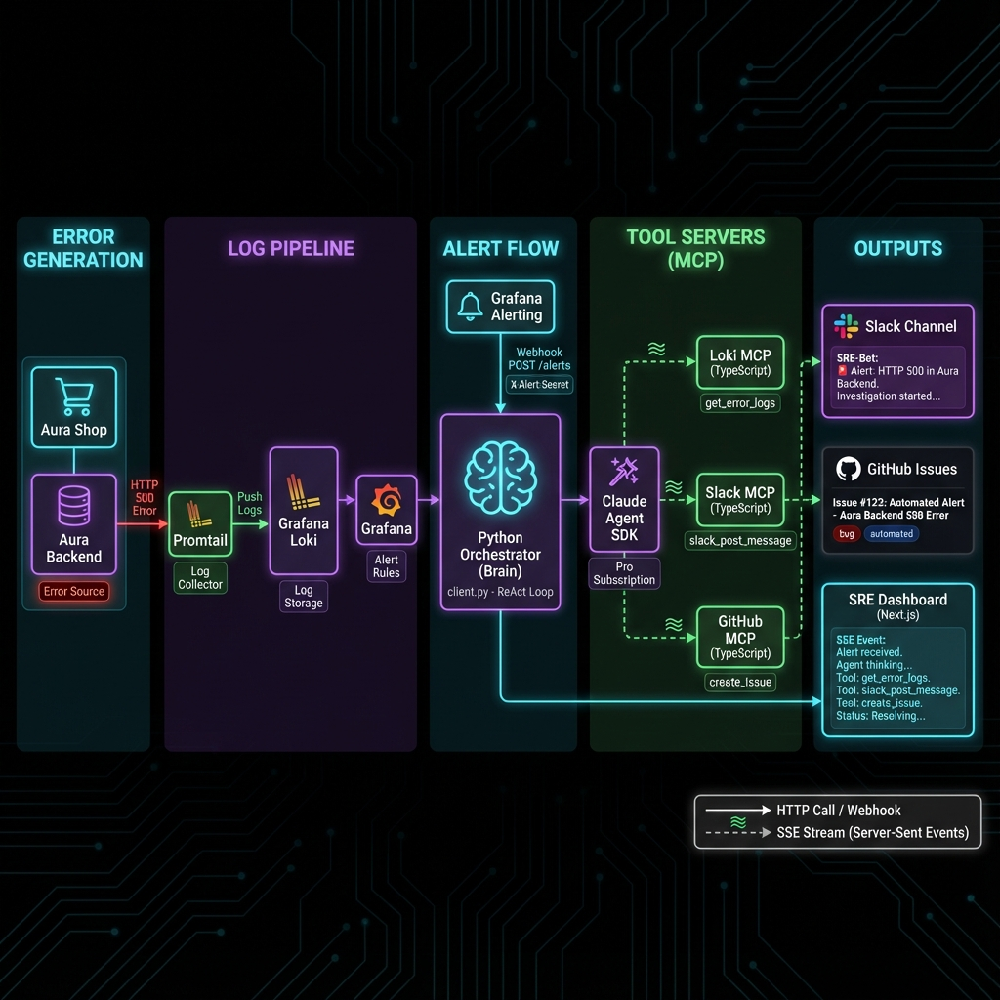
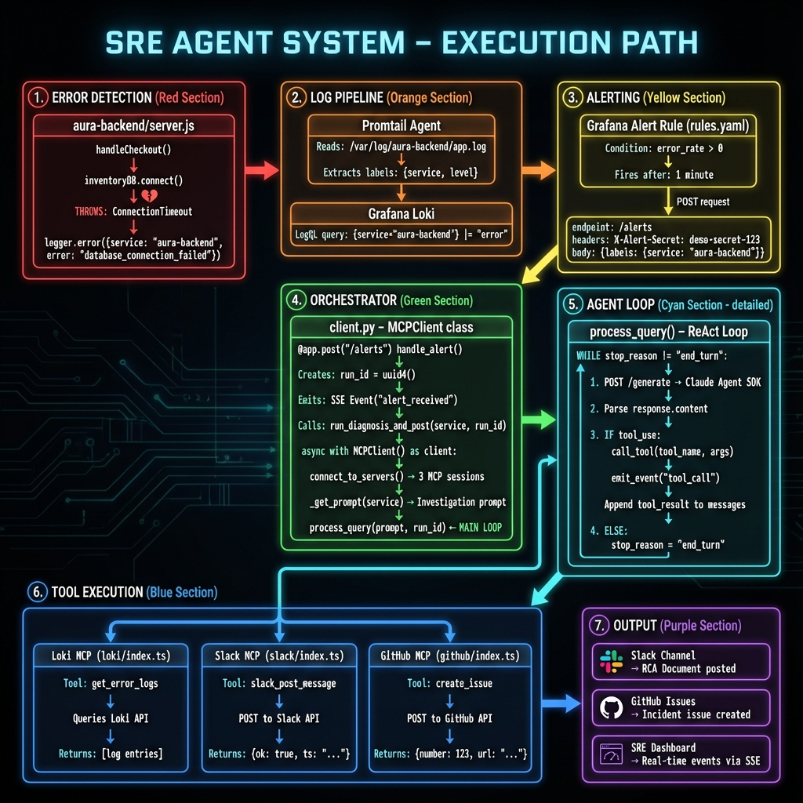

# SRE Agent Architecture Documentation

## System Overview

The SRE Agent is an AI-powered incident response system that automatically detects production errors, investigates root causes, and creates actionable documentation.

---

## High-Level Architecture



---

## Technical Code Flow



---

## Detailed Phase-by-Phase Walkthrough

### Phase 1: Error Detection 🔴

**Location**: `aura-quiet-living/backend/server.js`

```javascript
// When a user completes checkout
app.post('/api/checkout', async (req, res) => {
  if (faultInjection.db_down) {
    // Simulated database failure
    logger.error({
      service: 'aura-backend',
      error: 'ConnectionTimeout',
      message: 'database_connection_failed',
      db_host: 'inventory-db-01',
      retry_count: 5
    });
    return res.status(500).json({ error: 'Database error' });
  }
});
```

**Key Files**:
| File | Purpose |
|------|---------|
| [server.js](file:///Users/chetansingh/Documents/Hackathon/sre-agent/aura-quiet-living/backend/server.js) | Express server with fault injection |
| [logger.js](file:///Users/chetansingh/Documents/Hackathon/sre-agent/aura-quiet-living/backend/logger.js) | Winston logger configuration |

---

### Phase 2: Log Pipeline 🟠

**Components**: Promtail → Loki

```yaml
# promtail/config.yaml
scrape_configs:
  - job_name: aura-backend
    static_configs:
      - targets: [localhost]
        labels:
          job: aura-backend
          __path__: /var/log/aura-backend/app.log
    pipeline_stages:
      - json:
          expressions:
            level: level
            service: service
```

**Data Flow**:
```
app.log → Promtail (label extraction) → Loki (indexed storage)
```

---

### Phase 3: Alerting 🟡

**Location**: `observability/grafana/provisioning/alerting/`

```yaml
# rules.yaml
groups:
  - name: SRE Agent Alerts
    rules:
      - alert: aura-error-rate-alert
        expr: |
          sum(rate({service="aura-backend"} 
            |= "error" [1m])) > 0
        for: 1m
        labels:
          service: aura-backend
          severity: critical
```

```yaml
# contactpoints.yaml
contactPoints:
  - name: sre-agent-webhook
    receivers:
      - uid: sre-agent
        type: webhook
        settings:
          url: http://orchestrator:80/alerts
          httpMethod: POST
          authorization_scheme: X-Alert-Secret
          authorization_credentials: demo-secret-123
```

---

### Phase 4: Orchestrator (Brain) 🟢

**Location**: [client.py](file:///Users/chetansingh/Documents/Hackathon/sre-agent/sre_agent/client/client.py)

```python
# Alert Handler Endpoint
@app.post("/alerts")
async def handle_alert(request: Request, background_tasks: BackgroundTasks):
    # 1. Validate webhook secret
    is_request_valid(request.headers.get("Authorization"))
    
    # 2. Extract service name from alert payload
    body = await request.json()
    service = body.get("labels", {}).get("service")
    
    # 3. Generate unique run ID for tracking
    run_id = str(uuid.uuid4())
    
    # 4. Emit SSE event for dashboard
    emit_event(run_id, "alert_received", {"service": service})
    
    # 5. Start diagnosis in background
    background_tasks.add_task(
        run_diagnosis_and_post, 
        service=service,
        run_id=run_id
    )
    
    return {"status": "accepted", "run_id": run_id}
```

**Key Classes**:

| Class | File | Purpose |
|-------|------|---------|
| `MCPClient` | client.py:150 | Manages MCP server connections |
| `DiagnosisEvent` | client.py:75 | SSE event data structure |
| `ClientConfig` | schemas.py | Configuration for tools/services |

---

### Phase 5: Agent Loop (ReAct) 🔵

**Location**: [client.py:process_query()](file:///Users/chetansingh/Documents/Hackathon/sre-agent/sre_agent/client/client.py#L300)

```python
async def process_query(self, query: str, run_id: str = None):
    """The ReAct (Reason-Act-Observe) loop."""
    
    # Initialize messages with system + user prompt
    self.messages = [system_prompt, user_query]
    
    while self.stop_reason != "end_turn":
        # 1. REASON: Send to LLM for analysis
        response = requests.post(
            "http://agent-worker:3005/generate",  # Claude SDK
            json={"messages": self.messages, "tools": tools}
        )
        llm_response = Message(**response.json())
        
        # 2. ACT: Execute any tool calls
        for content in llm_response.content:
            if content.type == "tool_use":
                # Call MCP tool server
                result = await self.call_tool(
                    content.name,  # e.g., "get_error_logs"
                    content.input  # e.g., {"service": "aura-backend"}
                )
                # Emit SSE event for dashboard
                emit_event(run_id, "tool_call", {
                    "tool": content.name,
                    "args": content.input
                })
                
        # 3. OBSERVE: Add result to conversation
        self.messages.append(tool_result_message)
        
        # Check if agent is done
        self.stop_reason = llm_response.stop_reason
```

**Loop Diagram**:
```
┌─────────────────────────────────────────────────┐
│                 ReAct Loop                       │
├─────────────────────────────────────────────────┤
│                                                  │
│  ┌─────────┐    ┌─────────┐    ┌─────────────┐ │
│  │ REASON  │───▶│  ACT    │───▶│  OBSERVE    │ │
│  │ (LLM)   │    │ (Tools) │    │ (Results)   │ │
│  └─────────┘    └─────────┘    └──────┬──────┘ │
│       ▲                               │         │
│       └───────────────────────────────┘         │
│                                                  │
│         Repeat until stop_reason = "end_turn"   │
└─────────────────────────────────────────────────┘
```

---

### Phase 6: Tool Execution (MCP) 🟣

**MCP Server Architecture**:

```
┌──────────────────────────────────────────────────┐
│              Model Context Protocol              │
├──────────────────────────────────────────────────┤
│                                                   │
│  Orchestrator ──SSE──▶ MCP Server ──API──▶ Service│
│                                                   │
│  Example:                                         │
│  client.py ──SSE──▶ loki/index.ts ──HTTP──▶ Loki │
│                                                   │
└──────────────────────────────────────────────────┘
```

#### Loki MCP Server

**Location**: [loki/index.ts](file:///Users/chetansingh/Documents/Hackathon/sre-agent/sre_agent/servers/loki/index.ts)

```typescript
server.tool(
  "get_error_logs",
  "Fetches error logs for a service from Loki",
  { service: z.string().describe("Service name to query") },
  async ({ service }) => {
    const logs = await queryLoki({
      query: `{service="${service}"} |= "error"`,
      limit: 100
    });
    return { content: [{ type: "text", text: formatLogs(logs) }] };
  }
);
```

#### Slack MCP Server

**Location**: [slack/index.ts](file:///Users/chetansingh/Documents/Hackathon/sre-agent/sre_agent/servers/slack/index.ts)

```typescript
server.tool(
  "slack_post_message",
  "Posts a message to a Slack channel",
  { 
    channel: z.string(),
    text: z.string() 
  },
  async ({ channel, text }) => {
    const result = await slackClient.chat.postMessage({
      channel,
      text,
      mrkdwn: true
    });
    return { content: [{ type: "text", text: `Posted: ${result.ts}` }] };
  }
);
```

#### GitHub MCP Server

**Location**: [github/index.ts](file:///Users/chetansingh/Documents/Hackathon/sre-agent/sre_agent/servers/github/index.ts)

```typescript
server.tool(
  "create_issue",
  "Creates a GitHub issue for incident tracking",
  {
    title: z.string(),
    body: z.string(),
    labels: z.array(z.string()).optional()
  },
  async ({ title, body, labels }) => {
    const issue = await octokit.issues.create({
      owner: ORG,
      repo: REPO,
      title,
      body,
      labels: labels || ["incident", "auto-generated"]
    });
    return { content: [{ type: "text", text: `Created: ${issue.data.html_url}` }] };
  }
);
```

---

### Phase 7: Output Generation 🟤

**Three Outputs Created**:

#### 1. Slack RCA Document

```markdown
## 🔍 Incident Investigation: aura-backend

### 🧠 Chain of Thought
1. **Observation**: database_connection_failed errors
2. **Hypothesis**: inventory-db-01 is unreachable
3. **Evidence**: ConnectionTimeout after 5 retries
4. **Conclusion**: Database connection pool exhausted

### 📊 Evidence Table
| Evidence | Source | Finding |
|----------|--------|---------|
| ConnectionTimeout | Loki | DB unreachable |
| retry_count: 5 | Loki | Retries exhausted |

### 🎯 Root Cause
**Database server inventory-db-01 is not responding**
Confidence: 95%

### 📋 Runbook
1. Check DB server status: `kubectl get pods -l app=inventory-db`
2. Restart if needed: `kubectl rollout restart deployment/inventory-db`
3. Verify: `curl http://inventory-db:5432/health`
```

#### 2. GitHub Issue

```markdown
Title: [Incident] aura-backend: Database connection failure

Body: [Full RCA document as above]

Labels: incident, aura-backend, database, P1
```

#### 3. SRE Dashboard (SSE Events)

```json
{"event": "alert_received", "service": "aura-backend", "run_id": "abc123"}
{"event": "connecting_servers", "message": "Connecting to MCP servers..."}
{"event": "tool_call", "tool": "get_error_logs", "args": {"service": "aura-backend"}}
{"event": "tool_result", "tool": "get_error_logs", "duration": 0.12}
{"event": "tool_call", "tool": "slack_post_message", "args": {"channel": "..."}}
{"event": "tool_call", "tool": "create_issue", "args": {"title": "..."}}
{"event": "complete", "status": "success", "report": "..."}
```

---

## Component Summary

| Component | Language | Location | Purpose |
|-----------|----------|----------|---------|
| Aura Backend | Node.js | `aura-quiet-living/backend/` | Demo app with fault injection |
| Promtail | Config | `observability/promtail/` | Log shipping |
| Loki | Service | Docker | Log storage |
| Grafana | Service | Docker | Alerting |
| Orchestrator | Python | `sre_agent/client/` | Brain/ReAct loop |
| Agent Worker | TypeScript | `sre_agent/agent-worker/` | Claude SDK integration |
| Loki MCP | TypeScript | `sre_agent/servers/loki/` | Log query tool |
| Slack MCP | TypeScript | `sre_agent/servers/slack/` | Message posting tool |
| GitHub MCP | TypeScript | `sre_agent/servers/github/` | Issue creation tool |
| Dashboard | Next.js | `sre-dashboard/` | Real-time monitoring UI |

---

## Key Design Decisions

### 1. Model Context Protocol (MCP)
Using MCP decouples the LLM from tools, allowing:
- Independent scaling of tool servers
- Security isolation (tools run in separate containers)
- Easy addition of new tools without changing the orchestrator

### 2. Server-Sent Events (SSE)
SSE enables:
- Real-time "glass box" visibility into agent reasoning
- Low-latency dashboard updates
- Simple unidirectional streaming

### 3. Claude Agent SDK
The SDK provides:
- Built-in ReAct loop handling
- Native MCP support
- Pro subscription authentication (no API costs)
- Better multi-step reasoning than self-hosted LLMs
