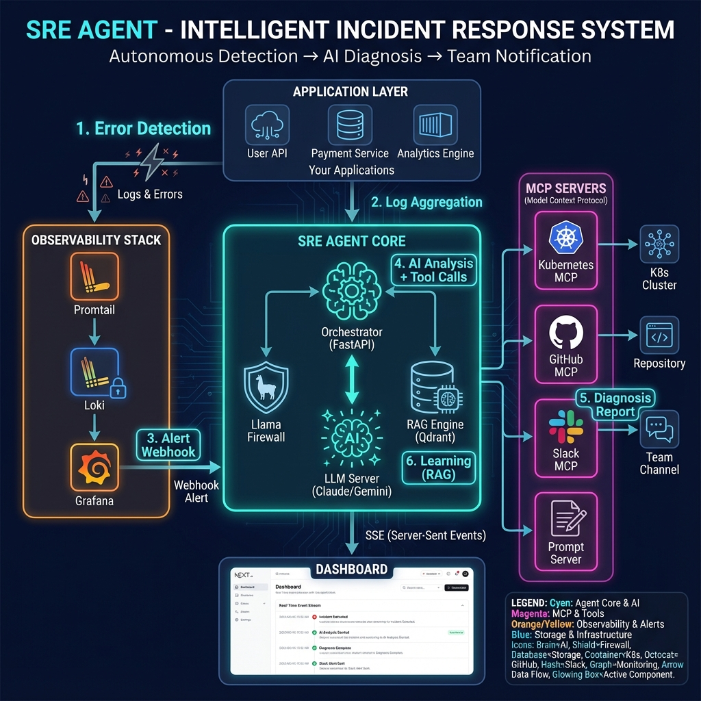
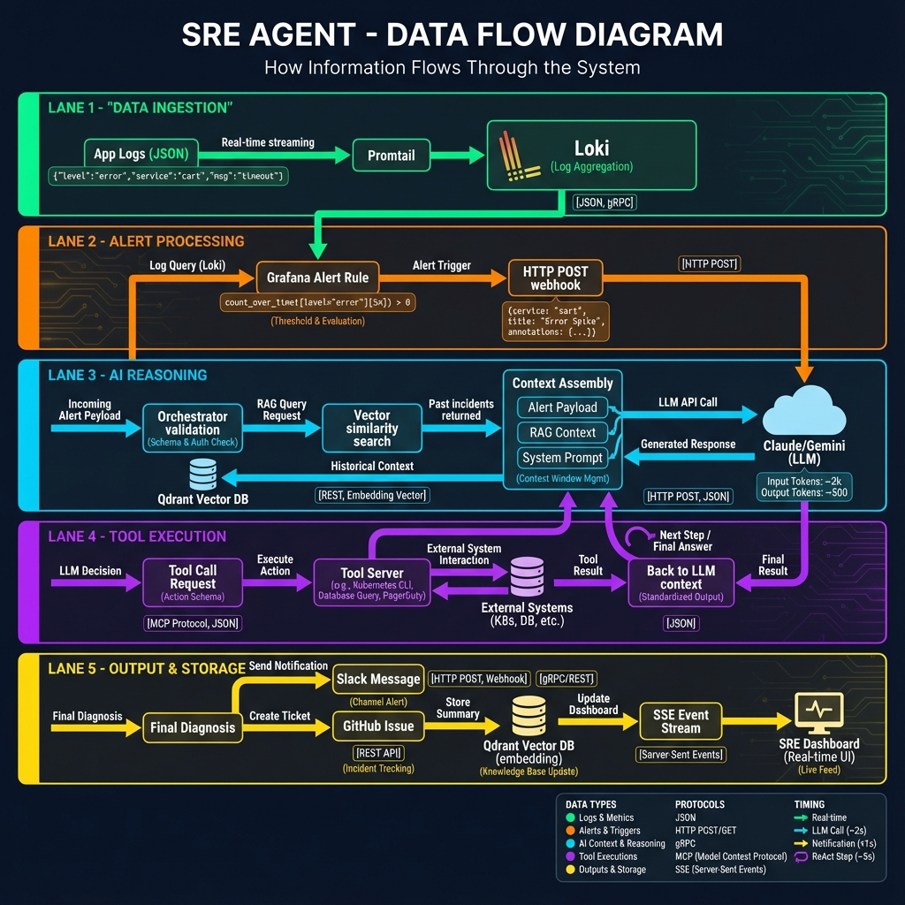
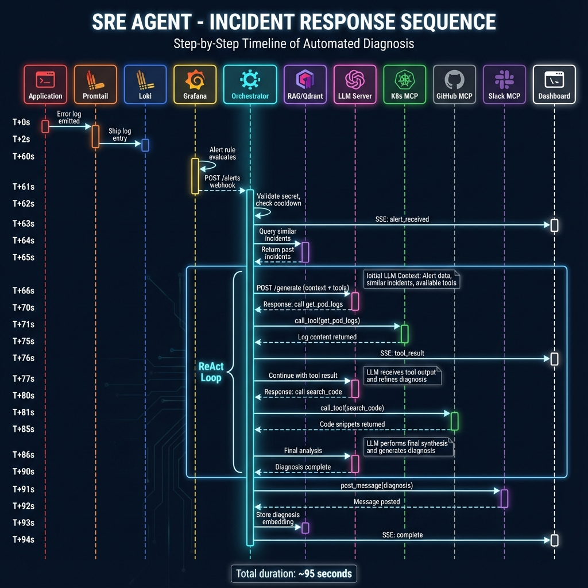
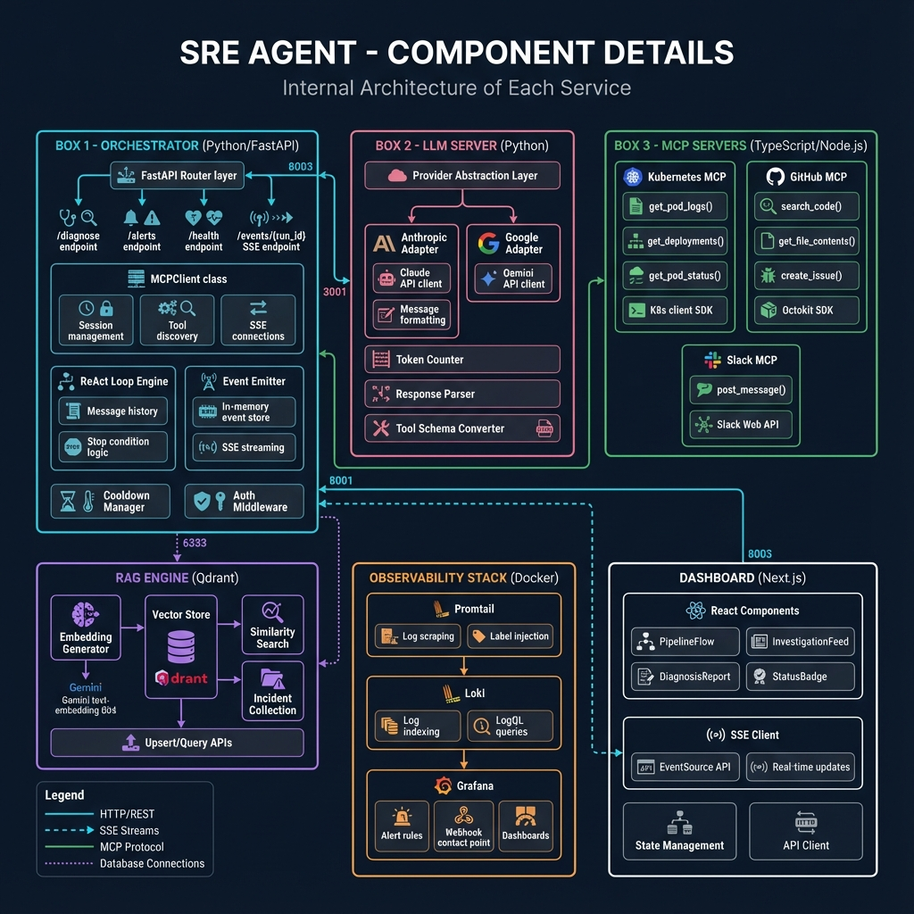
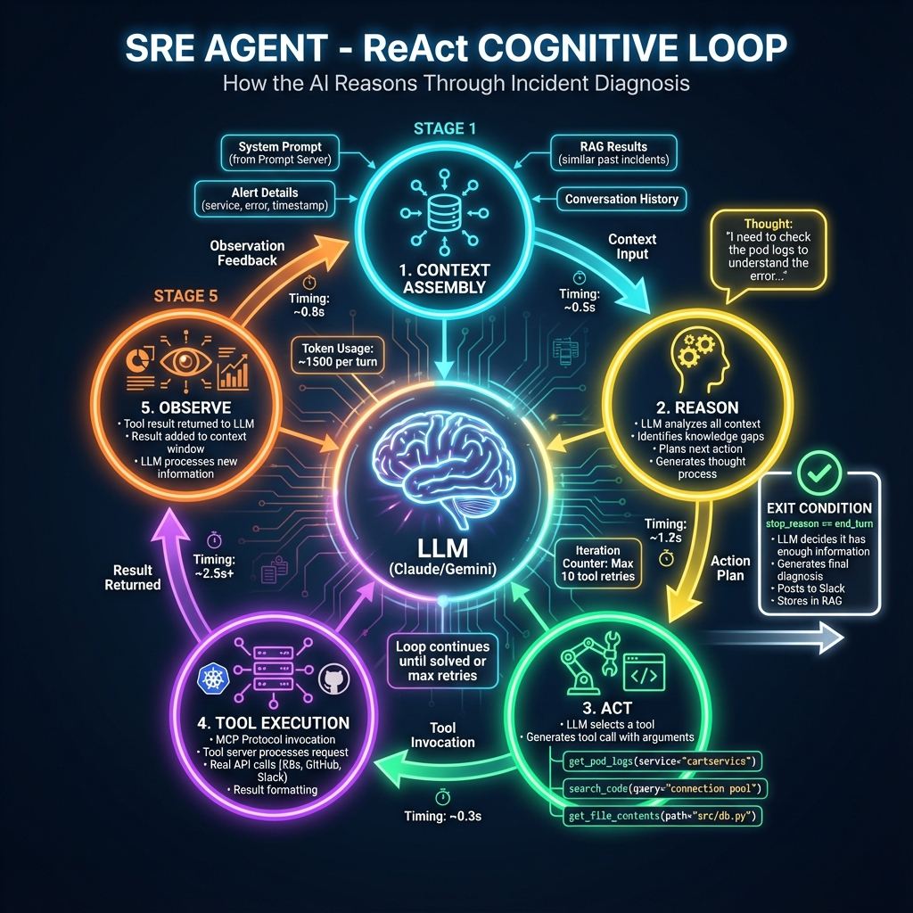
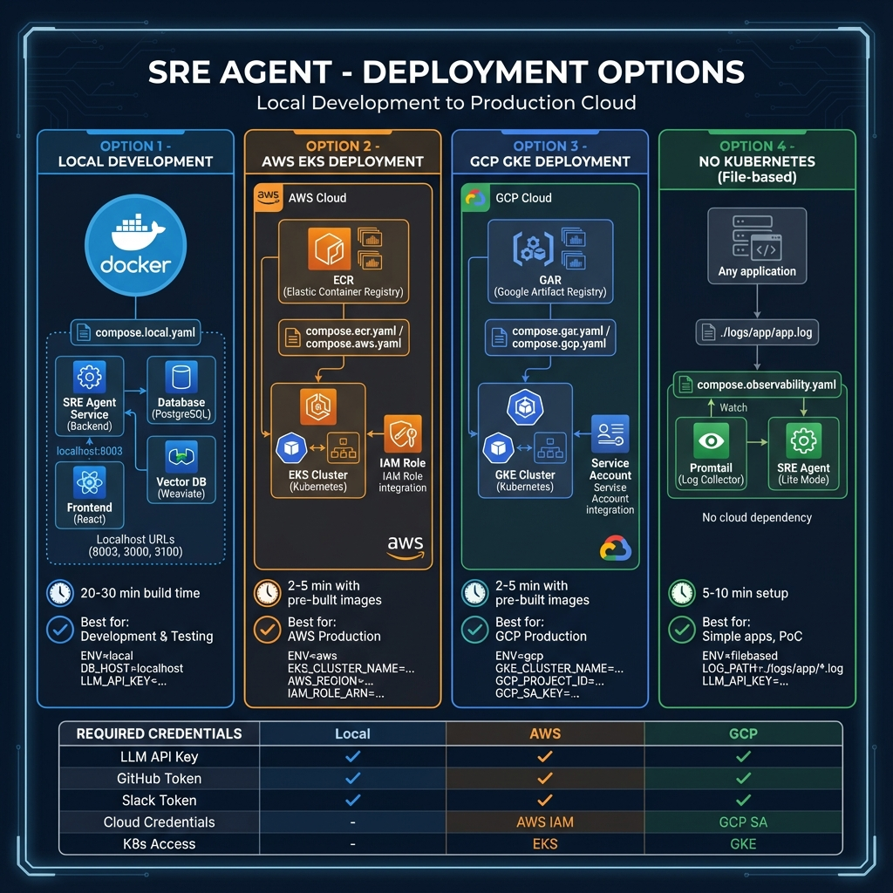

# SRE Agent - Architecture Diagrams

> **Comprehensive Technical Documentation**  
> Last Updated: December 2024

This document provides a complete visual guide to the SRE Agent architecture, data flows, and deployment options.

---

## Table of Contents

1. [System Architecture Overview](#1-system-architecture-overview)
2. [Data Flow Diagram](#2-data-flow-diagram)
3. [Sequence Diagram](#3-sequence-diagram)
4. [Component Details](#4-component-details)
5. [ReAct Cognitive Loop](#5-react-cognitive-loop)
6. [Deployment Options](#6-deployment-options)

---

## 1. System Architecture Overview



### Description

The SRE Agent is an **Intelligent Incident Response System** that automates detection, diagnosis, and notification of production incidents.

### Key Components

| Layer | Components | Purpose |
|-------|------------|---------|
| **Application Layer** | Your microservices | Generate logs and errors |
| **Observability Stack** | Promtail, Loki, Grafana | Log collection, storage, alerting |
| **SRE Agent Core** | Orchestrator, LLM Server, RAG, Firewall | AI-powered diagnosis |
| **MCP Servers** | Kubernetes, GitHub, Slack, Prompt | Tool execution via MCP protocol |
| **Dashboard** | Next.js React app | Real-time visualization |

### Data Flow Summary

```
Error Detection → Log Aggregation → Alert Webhook → AI Analysis → Tool Calls → Diagnosis Report → Learning (RAG)
```

---

## 2. Data Flow Diagram



### Description

This diagram shows how information flows through the system from error detection to final diagnosis.

### Flow Lanes

#### Lane 1: Data Ingestion (Green)
```
Application Logs (JSON) → Promtail → Loki
```
- Log format: `{"level":"error","service":"cart","msg":"timeout"}`
- Real-time streaming via Promtail
- Indexed storage in Loki

#### Lane 2: Alert Processing (Orange)
```
Loki → Grafana Alert Rule → HTTP POST Webhook
```
- Alert query: `count_over_time({level="error"}[5m]) > 0`
- Webhook payload: `{service, title, annotations}`
- Cooldown mechanism to prevent alert storms

#### Lane 3: AI Reasoning (Cyan)
```
Webhook → Orchestrator → RAG Query → Context Assembly → LLM API
```
- Vector similarity search for past incidents
- Context: Alert + RAG Results + System Prompt
- Token tracking for cost management

#### Lane 4: Tool Execution (Purple)
```
LLM Decision → MCP Protocol → Tool Server → Result → Back to LLM
```
- ReAct loop: Reason → Act → Observe
- Max 10 tool retries
- Real-time tool results

#### Lane 5: Output & Storage (Yellow)
```
Diagnosis → Slack Message + GitHub Issue + RAG Storage + Dashboard SSE
```
- Multi-channel output
- Incident learning for future reference

---

## 3. Sequence Diagram



### Description

UML-style sequence diagram showing the step-by-step timeline of an automated incident response.

### Timeline

| Time | Event | Description |
|------|-------|-------------|
| T+0s | Error occurs | Application throws an error |
| T+2s | Log shipped | Promtail sends log to Loki |
| T+60s | Alert evaluates | Grafana checks alert rules |
| T+61s | Webhook fires | POST to /alerts endpoint |
| T+62s | Validation | Check secret, cooldown |
| T+63s | Dashboard notified | SSE: alert_received |
| T+64s | RAG query | Search similar past incidents |
| T+66s | LLM request | Send context + available tools |
| T+70-85s | Tool loop | Multiple tool calls (K8s, GitHub) |
| T+90s | Diagnosis complete | LLM generates final analysis |
| T+91s | Slack post | Send diagnosis to team |
| T+93s | RAG storage | Store for future learning |
| T+94s | Dashboard complete | SSE: complete |

**Total Duration: ~95 seconds** (vs 30-60 minutes manually)

### Participants

1. Application
2. Promtail
3. Loki
4. Grafana
5. **Orchestrator** (Main Actor)
6. RAG/Qdrant
7. LLM Server
8. Kubernetes MCP
9. GitHub MCP
10. Slack MCP
11. Dashboard

---

## 4. Component Details



### Description

Internal architecture of each service showing classes, functions, and responsibilities.

### Orchestrator (Python/FastAPI) - Port 8003

```python
# Key Components
├── FastAPI Router
│   ├── POST /diagnose      # Manual trigger
│   ├── POST /alerts        # Grafana webhook
│   ├── GET /health         # Health check
│   └── GET /events/{id}    # SSE stream
├── MCPClient
│   ├── Session management
│   ├── Tool discovery
│   └── SSE connections
├── ReAct Loop Engine
│   ├── Message history
│   └── Stop condition logic
├── Event Emitter
│   ├── In-memory store
│   └── SSE streaming
├── Cooldown Manager
└── Auth Middleware
```

### LLM Server (Python) - Port 8000

```python
├── Provider Abstraction Layer
├── Anthropic Adapter
│   ├── Claude API client
│   └── Message formatting
├── Google Adapter
│   └── Gemini API client
├── Token Counter
├── Response Parser
└── Tool Schema Converter
```

### MCP Servers (TypeScript/Node.js) - Port 3001

```typescript
├── Kubernetes MCP
│   ├── get_pod_logs()
│   ├── get_deployments()
│   ├── get_pod_status()
│   └── @kubernetes/client-node
├── GitHub MCP
│   ├── search_code()
│   ├── get_file_contents()
│   ├── create_issue()
│   └── Octokit SDK
└── Slack MCP
    ├── post_message()
    └── Slack Web API
```

### RAG Engine (Qdrant) - Port 6333

```
├── Vector Store (1536 dimensions)
├── Embedding Generator
│   └── Gemini text-embedding-004
├── Similarity Search (cosine)
├── Incident Collection
└── Upsert/Query APIs
```

### Observability Stack (Docker)

```
├── Promtail
│   ├── Log scraping
│   └── Label injection
├── Loki - Port 3100
│   ├── Log indexing
│   └── LogQL queries
└── Grafana - Port 3000
    ├── Alert rules
    ├── Webhook contact point
    └── Dashboards
```

### Dashboard (Next.js) - Port 3000

```typescript
├── React Components
│   ├── PipelineFlow
│   ├── InvestigationFeed
│   ├── DiagnosisReport
│   └── StatusBadge
├── SSE Client
│   ├── EventSource API
│   └── Real-time updates
├── State Management
└── API Client
```

---

## 5. ReAct Cognitive Loop



### Description

The ReAct (Reason-Act-Observe) pattern is the cognitive architecture that enables the AI to iteratively solve problems.

### The Loop

```
┌─────────────────────────────────────────────────────────────┐
│                                                             │
│   ┌─────────────┐                         ┌─────────────┐   │
│   │   CONTEXT   │ ──────────────────────► │   REASON    │   │
│   │  ASSEMBLY   │                         │             │   │
│   └─────────────┘                         └──────┬──────┘   │
│         ▲                                        │          │
│         │                                        ▼          │
│   ┌─────┴─────┐                          ┌─────────────┐   │
│   │  OBSERVE  │ ◄─────────────────────── │     ACT     │   │
│   │           │                          │             │   │
│   └───────────┘                          └──────┬──────┘   │
│         ▲                                        │          │
│         │         ┌─────────────┐                │          │
│         └──────── │    TOOL     │ ◄──────────────┘          │
│                   │  EXECUTION  │                           │
│                   └─────────────┘                           │
│                                                             │
└─────────────────────────────────────────────────────────────┘
                           │
                           ▼
                    ┌─────────────┐
                    │    EXIT     │
                    │ (Diagnosis) │
                    └─────────────┘
```

### Stage Details

#### 1. Context Assembly
- System Prompt (from Prompt Server)
- Alert Details (service, error, timestamp)
- RAG Results (similar past incidents)
- Conversation History

#### 2. Reason
- LLM analyzes all available context
- Identifies knowledge gaps
- Plans next action
- Example thought: *"I need to check the pod logs to understand the error..."*

#### 3. Act
- LLM selects a tool from available options
- Generates tool call with arguments
- Examples:
  - `get_pod_logs(service="cartservice")`
  - `search_code(query="connection pool")`
  - `get_file_contents(path="src/db.py")`

#### 4. Tool Execution
- MCP Protocol invocation
- Tool server processes request
- Real API calls (Kubernetes, GitHub, Slack)
- Result formatting

#### 5. Observe
- Tool result returned to LLM
- Result added to context window
- LLM processes new information
- Loop continues or exits

### Exit Condition

```python
while stop_reason != "end_turn" and tool_retries < max_retries:
    # Continue loop
    pass

# Exit when:
# - LLM says "end_turn" (has enough info)
# - Max retries reached (10 attempts)
```

---

## 6. Deployment Options



### Description

Four deployment scenarios from local development to production cloud.

### Option Comparison

| Aspect | Local | AWS EKS | GCP GKE | No Kubernetes |
|--------|-------|---------|---------|---------------|
| **Compose File** | `compose.local.yaml` | `compose.ecr.yaml` | `compose.gar.yaml` | `compose.observability.yaml` |
| **Build Time** | 20-30 min | 2-5 min | 2-5 min | Fast |
| **K8s Required** | No | Yes (EKS) | Yes (GKE) | No |
| **Best For** | Development | AWS Prod | GCP Prod | Simple PoC |

### Option 1: Local Development

```bash
# Build from source
docker compose -f compose.local.yaml up --build

# Services available at:
# - Orchestrator: http://localhost:8003
# - Dashboard: http://localhost:3000
# - Grafana: http://localhost:3000
# - Loki: http://localhost:3100
```

### Option 2: AWS EKS Deployment

```bash
# Authenticate with ECR
aws ecr get-login-password --region $AWS_REGION | \
  docker login --username AWS --password-stdin $AWS_ACCOUNT_ID.dkr.ecr.$AWS_REGION.amazonaws.com

# Deploy with pre-built images
docker compose -f compose.ecr.yaml up -d
```

**Required:**
- AWS IAM credentials in `~/.aws/credentials`
- EKS cluster access
- ECR repository with images

### Option 3: GCP GKE Deployment

```bash
# Authenticate with GAR
gcloud auth configure-docker $GCP_REGION-docker.pkg.dev

# Deploy with pre-built images
docker compose -f compose.gar.yaml up -d
```

**Required:**
- GCP Service Account
- GKE cluster access
- GAR repository with images

### Option 4: No Kubernetes (File-based)

For applications without Kubernetes:

```bash
# Start observability stack only
docker compose -f compose.observability.yaml up -d

# Start SRE Agent with local compose
docker compose -f compose.local.yaml up -d
```

**Configure log path in** `observability/promtail/promtail.yaml`:
```yaml
scrape_configs:
  - job_name: myapp
    static_configs:
      - targets: [localhost]
        labels:
          job: myapp
          __path__: /var/log/myapp/*.log
```

### Required Credentials Matrix

| Credential | Local | AWS | GCP | Purpose |
|------------|:-----:|:---:|:---:|---------|
| `ANTHROPIC_API_KEY` or `GEMINI_API_KEY` | ✓ | ✓ | ✓ | LLM API access |
| `GITHUB_PERSONAL_ACCESS_TOKEN` | ✓ | ✓ | ✓ | Code search |
| `SLACK_BOT_TOKEN` | ✓ | ✓ | ✓ | Team notifications |
| `DEV_BEARER_TOKEN` | ✓ | ✓ | ✓ | API authentication |
| AWS IAM Credentials | - | ✓ | - | EKS access |
| GCP Service Account | - | - | ✓ | GKE access |
| `HF_TOKEN` | Optional | Optional | Optional | Llama Firewall |

---

## Quick Reference

### Service Ports

| Service | Port | Protocol |
|---------|------|----------|
| Orchestrator | 8003 | HTTP/REST |
| LLM Server | 8000 | HTTP/REST |
| MCP Servers | 3001 | SSE/MCP |
| Grafana | 3000 | HTTP |
| Loki | 3100 | HTTP |
| Qdrant | 6333 | HTTP/gRPC |
| Dashboard | 3000 | HTTP |

### API Endpoints

```bash
# Health check
GET http://localhost:8003/health

# Manual diagnosis
POST http://localhost:8003/diagnose
Content-Type: application/x-www-form-urlencoded
Authorization: Bearer <token>
Body: text=<service-name>

# Alert webhook (for Grafana)
POST http://localhost:8003/alerts
Content-Type: application/json
X-Alert-Secret: <secret>
Body: {service, title, annotations}

# SSE event stream
GET http://localhost:8003/events/<run_id>

# Get latest alert run
GET http://localhost:8003/latest-run
```

---

## Next Steps

1. **[Production Journey](./production-journey.md)** - Best practices for production
2. **[Security Testing](./security-testing.md)** - Security considerations
3. **[Credentials Guide](./credentials.md)** - Detailed credential setup

---

*Document generated by SRE Agent Technical Documentation*
