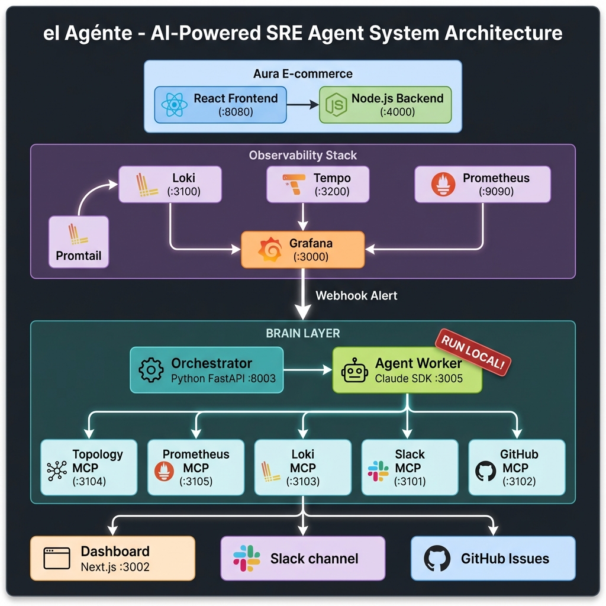
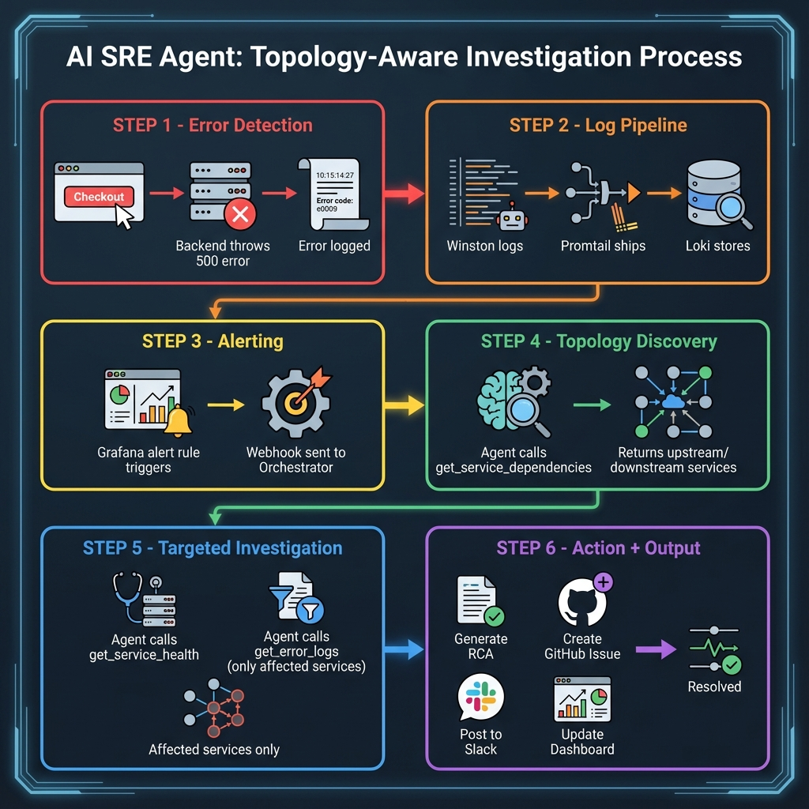
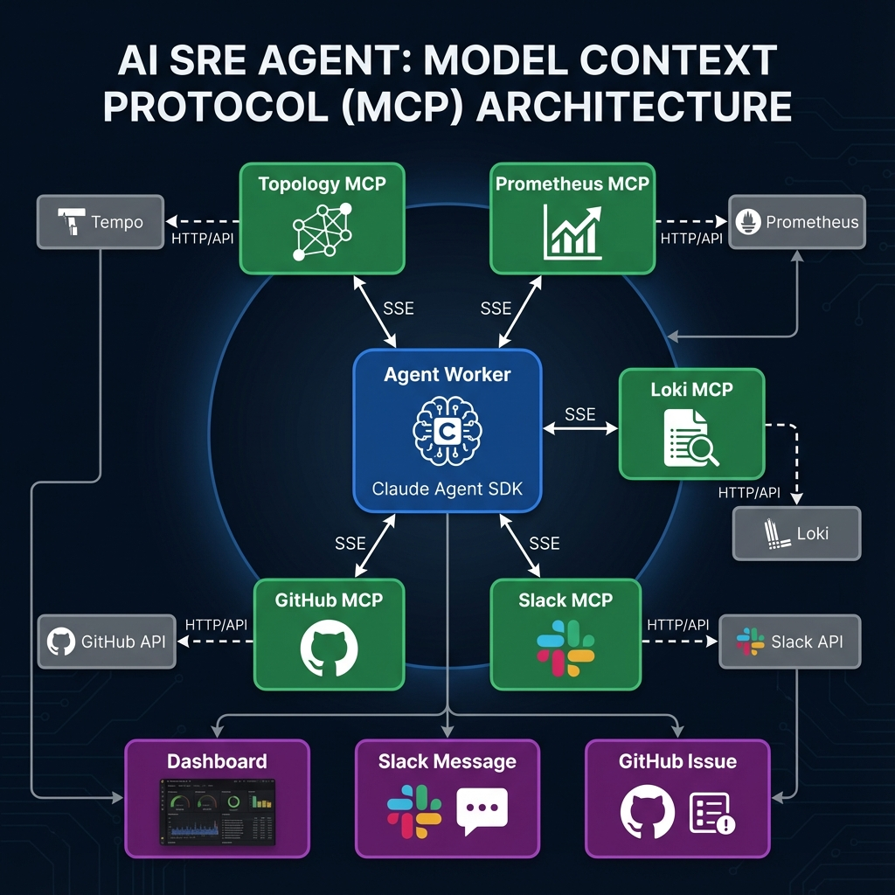

# el Agénte - Topology-Aware SRE Agent

> **Production-Grade AI-Powered Incident Response System**  
> **Version**: 2.0 (Topology-Aware)  
> **Last Updated**: December 20, 2024  

---

## 🎯 Executive Summary

**el Agénte** is an AI-powered SRE (Site Reliability Engineering) agent that automatically detects production errors, investigates root causes using topology discovery, and creates actionable documentation—all in under 2 minutes.

### The Problem We Solve

> "Every minute of downtime costs $5,600. Traditional monitoring tells you WHAT failed, not WHY."

Modern enterprises run complex microservices. When something breaks at 3 AM:
- Engineers spend **70% of incident time** just gathering context
- Average MTTR (Mean Time To Recovery) is **60+ minutes**
- Multiple services affected, but which is the root cause?

### Our Solution

el Agénte investigates like a **senior SRE engineer**:
1. **Discovers Topology** - Understands service dependencies before investigating
2. **Gathers Targeted Evidence** - Only queries affected services, not the entire system
3. **Forms Hypotheses** - Uses AI reasoning to identify root cause
4. **Takes Action** - Posts to Slack, creates GitHub issues, generates runbooks

**Result**: MTTR from hours to minutes. Complete RCA documentation. No more 3 AM wake-up calls.

---

## 🏗️ System Architecture

### High-Level Overview



> **Note**: The agent-worker MUST run locally (not in Docker) to access Claude CLI credentials from `~/.claude/`

### Architecture Layers

| Layer | Components | Purpose |
|-------|------------|---------|
| **Demo App** | React Frontend, Node.js Backend | E-commerce with fault injection |
| **Observability** | Promtail, Loki, Tempo, Prometheus, Grafana | MELT stack |
| **Brain** | Orchestrator (Python), Agent Worker (Local) | Coordination + AI reasoning |
| **Tools** | 5 MCP Servers | Topology, Metrics, Logs, Slack, GitHub |
| **Outputs** | Dashboard, Slack, GitHub | Real-time UI, RCA, Issues |

### Reference Diagrams


---

## 📊 Data Flow

### Topology-Aware Investigation Process



### Investigation Steps

| Step | Tool | Purpose |
|------|------|---------|
| 1️⃣ | `get_service_dependencies` | Discover upstream/downstream services |
| 2️⃣ | `get_impact_radius` | Find all affected services |
| 3️⃣ | `get_service_health` | Check error rates, latency |
| 4️⃣ | `check_anomalies` | Compare to baseline metrics |
| 5️⃣ | `get_error_logs` | Query ONLY affected services |
| 6️⃣ | `slack_post_message` | Post RCA to channel |
| 7️⃣ | `create_issue` | Create GitHub incident issue |

### Reference Diagrams


---

## 🔄 MCP Architecture (Model Context Protocol)



### How MCP Works

```
Agent Worker (Claude SDK)
         │
         │ SSE Protocol
         ▼
    ┌─────────────────┐
    │   MCP Server    │ ◄── TypeScript service
    │  (e.g., Loki)   │
    └────────┬────────┘
             │
             │ HTTP/API
             ▼
    ┌─────────────────┐
    │ Backend Service │ ◄── Loki, Tempo, Slack, etc.
    └─────────────────┘
```

### Benefits of MCP
- **Decoupling**: LLM doesn't need to know API details
- **Security**: Tools run in isolated containers
- **Extensibility**: Add new tools without changing agent
- **Protocol**: Standard SSE for all tool communication

### Sequence Diagram


---

## 🧩 Component Details

### 1. Demo Application (Aura Quiet Living)

| Component | Technology | Port | Purpose |
|-----------|------------|------|---------|
| Frontend | React + Vite | 8080 | E-commerce storefront |
| Backend | Node.js + Express | 4000 | API server with fault injection |

**Key Files**:
- `aura-quiet-living/backend/server.js` - Main server with fault injection
- `aura-quiet-living/backend/tracing.js` - OpenTelemetry instrumentation
- `aura-quiet-living/backend/logger.js` - Winston logging

**Fault Injection API**:
```bash
# Enable database fault
curl -X POST http://localhost:4000/api/admin/fault \
  -H "Content-Type: application/json" \
  -d '{"db_down": true}'

# Clear fault
curl -X POST http://localhost:4000/api/admin/fault \
  -H "Content-Type: application/json" \
  -d '{"db_down": false}'
```

---

### 2. Observability Stack

| Service | Image | Port | Purpose |
|---------|-------|------|---------|
| Loki | grafana/loki:2.9.8 | 3100 | Log aggregation |
| Tempo | grafana/tempo:latest | 3200, 4317, 4318 | Distributed tracing |
| Prometheus | prom/prometheus:latest | 9090 | Metrics collection |
| Promtail | grafana/promtail:2.9.8 | - | Log shipping |
| Grafana | grafana/grafana:10.4.6 | 3000 | Visualization + Alerting |

**Config Files**:
- `observability/loki/local-config.yaml`
- `observability/tempo/tempo.yaml`
- `observability/prometheus/prometheus.yaml`
- `observability/promtail/config.yaml`
- `observability/grafana/provisioning/alerting/rules.yaml`

---

### 3. MCP Servers (Model Context Protocol)

| Server | Port | Tools | Backend |
|--------|------|-------|---------|
| Topology MCP | 3104 | `get_service_dependencies`, `get_impact_radius`, `get_service_graph` | Tempo API |
| Prometheus MCP | 3105 | `get_service_health`, `check_anomalies`, `get_resource_usage` | Prometheus API |
| Loki MCP | 3103 | `get_error_logs` | Loki API |
| Slack MCP | 3101 | `slack_post_message` | Slack API |
| GitHub MCP | 3102 | `create_issue` | GitHub API |

**Key Files**:
- `sre_agent/servers/topology-server/src/index.ts`
- `sre_agent/servers/prometheus-server/src/index.ts`
- `sre_agent/servers/loki/index.ts`
- `sre_agent/servers/slack/index.ts`
- `sre_agent/servers/github/index.ts`

---

### 4. Brain (Orchestrator)

| Component | Technology | Port | Purpose |
|-----------|------------|------|---------|
| Orchestrator | Python FastAPI | 8003 | Alert handling, SSE streaming, coordination |

**Key Endpoints**:
- `POST /alerts` - Receives Grafana webhooks
- `POST /diagnose` - Manual diagnosis trigger
- `GET /events/{run_id}` - SSE event stream
- `GET /latest-run` - Dashboard polling endpoint

**Key File**: `sre_agent/client/client.py`

---

### 5. Agent Worker (LOCAL)

| Component | Technology | Port | Purpose |
|-----------|------------|------|---------|
| Agent Worker | TypeScript + Claude Agent SDK | 3005 | AI reasoning, MCP tool orchestration |

> ⚠️ **CRITICAL**: Must run locally (not in Docker) for Claude CLI credentials

**Key File**: `sre_agent/agent-worker/src/index.ts`

**Authentication**: Uses `~/.claude/` folder for Pro subscription OAuth (no API costs)

---

### 6. Dashboard (SRE Dashboard)

| Component | Technology | Port | Purpose |
|-----------|------------|------|---------|
| Dashboard | Next.js 16 + React | 3001 | Real-time investigation UI |

**Key UI Components**:
- `page.tsx` - Main page with SSE event handling
- `PipelineFlow.tsx` - Investigation pipeline visualization
- `ChainOfThought.tsx` - Agent reasoning steps
- `FaultPropagationChain.tsx` - Fault impact path
- `ServiceDependencyGraph.tsx` - Service topology map
- `HypothesisPanel.tsx` - Diagnosis + Runbook
- `DiagnosisReport.tsx` - Full RCA report

---

## 🔧 Key Decisions Made

### Decision 1: Claude Agent SDK over Self-Hosted LLM
**Date**: December 7, 2025  
**Problem**: Self-hosted LLM at `quasarmarket.coforge.com` was stuck in tool loops (called `get_error_logs` 20+ times without progress)  
**Solution**: Use Claude Agent SDK with Pro subscription via OAuth  
**Result**: ✅ Successful multi-step reasoning with proper tool orchestration

### Decision 2: Local Agent Worker (Not Docker)
**Date**: December 7, 2025  
**Problem**: Docker can't access `~/.claude/` credentials properly  
**Solution**: Run agent-worker locally with environment variables pointing to Docker MCP servers  
**Result**: ✅ Works perfectly with `http://localhost:310X/sse` URLs

### Decision 3: Topology-Aware Investigation
**Date**: December 9, 2025  
**Problem**: Agent was querying logs without understanding service relationships  
**Solution**: Added Tempo-based topology discovery BEFORE log gathering  
**Result**: ✅ Agent now queries only affected services with proper fault propagation

### Decision 4: MCP over Direct Tool Integration
**Date**: November 2024  
**Reason**: Decouples LLM from tools, enables security isolation, easy tool addition  
**Implementation**: Each tool runs in its own TypeScript container with SSE protocol

### Decision 5: Neo-Brutalism UI Design
**Date**: December 2024  
**Reason**: Dramatic, memorable visual style for hackathon presentation  
**Implementation**: Bold borders, shadows, vibrant colors, uppercase text

---

## 🚀 Commands to Run the App

### Prerequisites
- Docker Desktop running
- Node.js 20+ installed
- Claude CLI authenticated (`~/.claude/` folder exists)

### Step 1: Start Docker Services

```bash
cd /Users/chetansingh/Documents/Hackathon/sre-agent

# Start all Docker services (except agent-worker)
docker compose -f compose.local.yaml up -d \
  loki promtail grafana tempo prometheus \
  loki-mcp topology-mcp prometheus-mcp slack github \
  aura-backend aura-frontend orchestrator
```

### Step 2: Start Agent Worker (LOCAL - REQUIRED!)

> ⚠️ **IMPORTANT**: The agent-worker MUST run locally because it uses Claude CLI credentials from `~/.claude/` for Pro subscription authentication. Docker cannot access these credentials properly.

```bash
cd /Users/chetansingh/Documents/Hackathon/sre-agent/sre_agent/agent-worker

# Build first (if not already built)
npm install
npm run build

# Run with all MCP URLs
LOKI_MCP_URL=http://localhost:3103/sse \
TOPOLOGY_MCP_URL=http://localhost:3104/sse \
PROMETHEUS_MCP_URL=http://localhost:3105/sse \
SLACK_MCP_URL=http://localhost:3101/sse \
GITHUB_MCP_URL=http://localhost:3102/sse \
GITHUB_ORGANISATION=PseudoDarwinist \
GITHUB_REPO_NAME=elAgente \
PORT=3005 \
npx tsx src/index.ts
```

### Step 3: Start Dashboard

```bash
cd /Users/chetansingh/Documents/Hackathon/sre-agent/sre-dashboard

npm install
npm run dev
```

### Step 4: Access the UIs

| Service | URL |
|---------|-----|
| **SRE Dashboard** | http://localhost:3001 |
| **Aura E-commerce** | http://localhost:8080 |
| **Grafana** | http://localhost:3000 |
| **Prometheus** | http://localhost:9090 |
| **Tempo** | http://localhost:3200 |

### Step 5: Run a Demo

```bash
# 1. Inject a database fault
curl -X POST http://localhost:4000/api/admin/fault \
  -H "Content-Type: application/json" \
  -d '{"db_down": true}'

# 2. Go to Dashboard (http://localhost:3001)
# 3. Type "aura-backend" in the search box
# 4. Click "Diagnose"
# 5. Watch the investigation progress!

# 6. Clear fault when done
curl -X POST http://localhost:4000/api/admin/fault \
  -H "Content-Type: application/json" \
  -d '{"db_down": false}'
```

---

## ✅ What's Working

| Feature | Status | Notes |
|---------|--------|-------|
| Error Detection | ✅ | Aura backend with fault injection |
| Log Pipeline | ✅ | Promtail → Loki → Grafana |
| Alerting | ✅ | Grafana rules trigger webhooks |
| Orchestrator | ✅ | FastAPI with SSE streaming |
| Agent Worker | ✅ | Claude SDK with topology-aware flow |
| Topology MCP | ✅ | Queries Tempo for dependencies |
| Prometheus MCP | ✅ | Queries Prometheus for health |
| Loki MCP | ✅ | Queries Loki for error logs |
| Slack MCP | ✅ | Posts RCA to channel |
| GitHub MCP | ✅ | Creates incident issues |
| Dashboard - Pipeline | ✅ | Shows investigation stages |
| Dashboard - Chain of Thought | ✅ | Shows agent reasoning |
| Dashboard - Hypothesis Panel | ✅ | Shows diagnosis + runbook |
| Dashboard - Fault Propagation | ⚠️ | Works but needs full app view |
| Dashboard - Service Map | ⚠️ | Component exists but shows nothing |
| Dashboard - Terminal | ❌ | Not working, should be removed |

---

## 🔴 Known Issues (To Fix)

### Issue 1: Terminal Component Not Working
**Current State**: Shows "Waiting for logs..." with no actual logs  
**Recommendation**: Remove the LiveTerminal component from the dashboard  
**File**: `sre-dashboard/src/app/page.tsx`

### Issue 2: Fault Propagation Shows Only Affected Service
**Current State**: Only shows the root cause service  
**Expected**: Should show the entire application architecture with green ✓ on working components and red ✗ on fault line  
**File**: `sre-dashboard/src/app/components/FaultPropagationChain.tsx`

### Issue 3: Service Map Shows "No services discovered"
**Current State**: Service graph parsing not receiving data from SSE events  
**Expected**: Should populate with discovered services and their health status  
**File**: `sre-dashboard/src/app/components/ServiceDependencyGraph.tsx`

---

## 📁 Project Structure

```
sre-agent/
├── .env                              # Environment configuration
├── compose.local.yaml                # Docker Compose (all services)
│
├── aura-quiet-living/                # Demo e-commerce app
│   ├── backend/
│   │   ├── server.js                 # Express server + fault injection
│   │   ├── tracing.js                # OpenTelemetry instrumentation
│   │   └── logger.js                 # Winston logging
│   └── frontend/                     # React storefront
│
├── sre_agent/
│   ├── client/
│   │   └── client.py                 # Orchestrator (FastAPI)
│   │
│   ├── agent-worker/                 # 🆕 Claude Agent SDK (RUN LOCAL!)
│   │   ├── package.json
│   │   ├── tsconfig.json
│   │   └── src/index.ts              # Agent with topology-aware workflow
│   │
│   └── servers/                      # MCP Tool Servers
│       ├── topology-server/          # 🆕 Tempo topology queries
│       ├── prometheus-server/        # 🆕 Prometheus health/metrics
│       ├── loki/                     # Loki log queries
│       ├── slack/                    # Slack message posting
│       └── github/                   # GitHub issue creation
│
├── sre-dashboard/                    # Next.js real-time dashboard
│   └── src/app/
│       ├── page.tsx                  # Main page + SSE handling
│       └── components/
│           ├── PipelineFlow.tsx      # Investigation pipeline
│           ├── ChainOfThought.tsx    # Agent reasoning steps
│           ├── FaultPropagationChain.tsx  # 🆕 Fault impact path
│           ├── ServiceDependencyGraph.tsx # 🆕 Service topology
│           ├── HypothesisPanel.tsx   # 🆕 Diagnosis + runbook
│           └── DiagnosisReport.tsx   # Full RCA report
│
├── observability/
│   ├── grafana/provisioning/         # Grafana config + alerts
│   ├── loki/                         # Loki config
│   ├── tempo/                        # 🆕 Tempo config
│   ├── prometheus/                   # 🆕 Prometheus config
│   └── promtail/                     # Promtail config
│
└── docs/
    ├── ARCHITECTURE.md               # This document
    ├── progress.md                   # Development log
    ├── progress2.md                  # Topology-aware phase log
    └── imgs/architecture/            # Architecture diagrams
```

---

## 📈 What's Left to Build

### Priority 1: Fix Dashboard Issues
- [ ] Remove Terminal component
- [ ] Fix Fault Propagation to show full app architecture
- [ ] Fix Service Map to display discovered services

### Priority 2: Visual Polish
- [ ] Add animated flow lines in pipeline
- [ ] Add particle effects for active investigation
- [ ] Improve color coding for health status

### Priority 3: Additional Features
- [ ] Auto-remediation (actually run runbook commands)
- [ ] Metrics correlation (Prometheus + logs)
- [ ] Historical incident comparison
- [ ] Team notifications (PagerDuty integration)

---

## 🎥 Verification Screenshots

### Successful E2E Test (December 9, 2025)


### Current Dashboard State (Issues Visible)


---

## 🏆 Key Talking Points

> "Traditional monitoring tells you WHAT failed. Our agent tells you WHY."

> "From alert to RCA in under 2 minutes, not 2 hours."

> "$5,600/minute × 60 min average MTTR = $336,000 per incident saved."

> "Agent creates GitHub issues and Slack posts—team wakes up to solutions, not problems."

---

**Last Updated**: December 9, 2025  
**Author**: el Agénte Team  
**Status**: Ready for Semi-Finals (with known issues documented)
